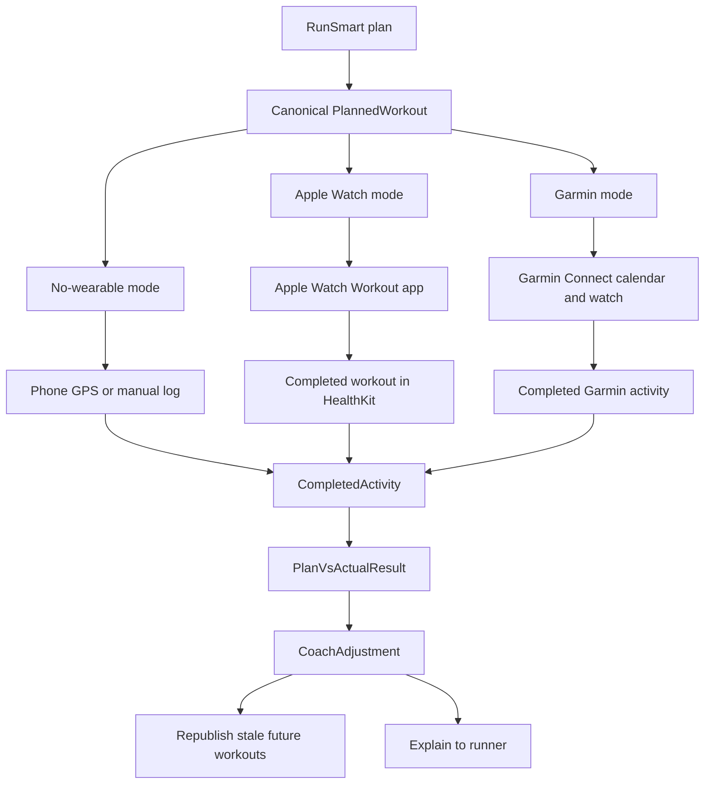

# Apple and Garmin Integration Architecture

Date: 2026-06-21
Status: proposed architecture, no code implemented

## Architecture Principle

RunSmart needs one internal coaching model, with Apple, Garmin, phone GPS, and manual logging as adapters.

Do not make `WorkoutSummary`, WorkoutKit payloads, or Garmin Training API payloads the source of truth. The source of truth should be provider-neutral and stable:

- RunSmart plans and planned workouts.
- Completed activities.
- Plan-vs-actual results.
- Recovery context.
- Coach adjustments.
- Execution and publish status per runner mode.

Most users will choose one execution mode, not both Apple Watch and Garmin. The architecture should support Apple, Garmin, and no-wearable runners with the same coaching loop instead of optimizing for dual-wearable users.

## Current Architecture Fit

Current source files that matter:

- `IOS RunSmart app/Models/RunSmartModels.swift`: current UI and domain models, including `WorkoutSummary`, `RecordedRun`, `RecoverySnapshot`, `RunReportDetail`, and `PostActivityOutcome`.
- `IOS RunSmart app/Services/StructuredWorkoutFactory.swift`: display-step generation from `WorkoutSummary`.
- `IOS RunSmart app/Services/HealthKit/HealthKitSyncService.swift`: HealthKit import, wellness read, and workout save.
- `IOS RunSmart app/Services/Garmin/GarminBridge.swift`: Garmin OAuth, activity reads, route points, connection status, and daily metrics.
- `IOS RunSmart app/Services/Garmin/GarminImportProcessor.swift`: Garmin activity normalization and route loading.
- `IOS RunSmart app/Services/Supabase/TrainingPlanRepository.swift`: active plan/workout persistence and mutation.
- `IOS RunSmart app/Services/Supabase/SupabaseRunSmartServices.swift`: production service boundary, device sync, completed activity processing, recovery, reports, and plan matching.

Current strengths:

- Existing `RecordedRun` is already provider-aware without being provider-owned.
- Existing `processCompletedActivity` is the right post-run pipeline.
- Existing Garmin OAuth callback follows the hard-learned `runsmart://` plus polling pattern.
- Existing HealthKit import already reads route and average heart rate.

Current gaps:

- No canonical export-safe planned workout model.
- `StructuredWorkoutFactory.WorkoutStep` is display-oriented and uses strings/colors.
- No execution-mode model for Apple, Garmin, phone GPS, and manual/no-wearable paths.
- No provider publish-status model for watch users.
- No plan-vs-actual result model.
- No source-neutral zone summary model.
- No WorkoutKit, App Intents, ActivityKit, widgets, watch target, or Garmin Training API mapper in source.

## Proposed Canonical Models

### RunSmartPlan

Purpose: top-level training plan independent of Apple or Garmin.

Fields:

- `id: UUID`
- `ownerAuthUserID: UUID`
- `title: String`
- `goalType: GoalType`
- `startDate: Date`
- `endDate: Date`
- `timezoneID: String`
- `totalWeeks: Int`
- `source: PlanSource`
- `createdAt: Date`
- `updatedAt: Date`
- `revision: Int`
- `workouts: [PlannedWorkout]`

Why it matters:

- Provider publishing needs stable revisions.
- Date-only workout scheduling must stay in user-local calendar semantics, matching existing lessons.

### PlannedWorkout

Purpose: one scheduled workout that can become an Apple WorkoutKit workout, Garmin Training API workout, phone GPS workout, or manual/treadmill workout.

Fields:

- `id: UUID`
- `planID: UUID`
- `scheduledDate: Date`
- `scheduledLocalDate: String`
- `title: String`
- `kind: WorkoutKind`
- `sport: SportType`
- `estimatedDurationSeconds: Int?`
- `distanceMeters: Double?`
- `steps: [WorkoutStep]`
- `primaryTarget: WorkoutTarget?`
- `notes: String?`
- `coachRationale: String?`
- `safetyConstraints: [SafetyConstraint]`
- `revision: Int`
- `createdBy: WorkoutCreationSource`
- `executionModes: [WorkoutExecutionMode]`
- `publishStatuses: [WorkoutPublishStatus]`

Why it matters:

- The same workout can be rendered in Today, exported to Apple/Garmin, or shown manually.
- `revision` lets publishers detect stale watch workouts after adaptation.
- No-wearable execution should be represented deliberately, not as "not published."

### WorkoutStep

Purpose: export-safe segment of a structured workout.

Fields:

- `id: UUID`
- `order: Int`
- `name: String`
- `stepType: StepType`
- `duration: StepDuration`
- `target: WorkoutTarget?`
- `repetitions: Int?`
- `children: [WorkoutStep]`
- `instructions: String?`
- `isOptional: Bool`

Why it matters:

- Apple, Garmin, and in-app execution all need structured steps.
- Repeats need to be modeled structurally, not as strings like `6 x 400 m`.

### WorkoutTarget

Purpose: target intensity or output for a workout or step.

Fields:

- `type: TargetType`
- `lowerBound: Double?`
- `upperBound: Double?`
- `unit: TargetUnit`
- `displayLabel: String`
- `source: TargetSource`

Example target types:

- Pace range.
- Heart-rate zone.
- RPE.
- Distance.
- Duration.
- Open/easy effort.

Why it matters:

- Apple may support pace, time, distance, and custom alerts.
- Garmin structured workouts can support step targets.
- In-app/manual execution still needs readable target labels.

### CompletedActivity

Purpose: source-neutral completed workout/run.

Fields:

- `id: UUID`
- `source: ActivitySource`
- `providerActivityID: String?`
- `consolidatedActivityID: String?`
- `sport: SportType`
- `startedAt: Date`
- `endedAt: Date`
- `timezoneID: String?`
- `distanceMeters: Double`
- `movingTimeSeconds: TimeInterval`
- `elapsedTimeSeconds: TimeInterval?`
- `averagePaceSecondsPerKm: Double?`
- `averageHeartRateBPM: Int?`
- `maxHeartRateBPM: Int?`
- `calories: Double?`
- `elevationGainMeters: Double?`
- `route: RouteSummary?`
- `heartRateZoneSummary: HeartRateZoneSummary?`
- `laps: [ActivityLap]`
- `rawSourceMetadata: [String: String]`
- `importedAt: Date`

Why it matters:

- Existing `RecordedRun` can map into this.
- Richer Garmin FIT/HealthKit details can be added without changing the analysis interface.

### ActivitySource

Purpose: normalized source identity.

Fields:

- `provider: Provider`
- `origin: ActivityOrigin`
- `displayName: String`
- `canRepublish: Bool`

Providers:

- `runSmartPhone`
- `appleHealthKit`
- `garmin`
- `manual`

Why it matters:

- Source-specific behavior belongs in adapters, not in analysis logic.

### HeartRateZoneSummary

Purpose: summarize time-in-zone independent of provider.

Fields:

- `source: ZoneSource`
- `configurationID: String?`
- `zones: [HeartRateZone]`
- `totalDurationSeconds: TimeInterval`
- `dominantZoneIndex: Int?`
- `highIntensitySeconds: TimeInterval`
- `easySeconds: TimeInterval`
- `computedAt: Date`

`HeartRateZone` fields:

- `index: Int`
- `name: String`
- `lowerBPM: Int?`
- `upperBPM: Int?`
- `durationSeconds: TimeInterval`
- `percent: Double`

Why it matters:

- Apple's iOS/watchOS 27 HealthKit zones and Garmin-derived zones can flow into the same analysis model.

### RouteSummary

Purpose: route data without forcing every screen to load every point.

Fields:

- `hasRoute: Bool`
- `pointCount: Int`
- `distanceMeters: Double`
- `elevationGainMeters: Double?`
- `startCoordinate: Coordinate?`
- `endCoordinate: Coordinate?`
- `boundingBox: BoundingBox?`
- `polyline: String?`
- `points: [RunRoutePoint]?`
- `sourceQuality: RouteQuality`

Why it matters:

- Garmin route-less runs and HealthKit route-backed runs need honest behavior.
- Courses API export needs route-quality checks.

### PlanVsActualResult

Purpose: compare what was prescribed to what happened.

Fields:

- `id: UUID`
- `plannedWorkoutID: UUID?`
- `completedActivityID: UUID`
- `matchConfidence: MatchConfidence`
- `completionStatus: CompletionStatus`
- `distanceDeltaPercent: Double?`
- `durationDeltaPercent: Double?`
- `paceDeltaSecondsPerKm: Double?`
- `targetHitSummary: TargetHitSummary`
- `zoneSummary: HeartRateZoneSummary?`
- `routeMatchResult: RouteMatchResult?`
- `effortClassification: EffortClassification`
- `coachSummary: String`
- `createdAt: Date`

Why it matters:

- This is the missing middle between import and adaptation.
- It should power post-run review and plan changes.

### RecoveryContext

Purpose: source-neutral readiness context with freshness and confidence.

Fields:

- `date: Date`
- `sourcePriority: [ActivitySource]`
- `sleepSeconds: TimeInterval?`
- `hrvMilliseconds: Double?`
- `restingHeartRateBPM: Int?`
- `bodyBattery: Int?`
- `trainingReadiness: Int?`
- `stress: Double?`
- `manualEnergy: Int?`
- `manualSoreness: Int?`
- `freshness: FreshnessStatus`
- `confidence: ConfidenceLevel`
- `limitations: [String]`

Why it matters:

- Recovery-aware adaptation should be transparent, not a hidden score.
- Garmin and HealthKit missing/stale data are normal states.

### CoachAdjustment

Purpose: auditable plan change.

Fields:

- `id: UUID`
- `planID: UUID`
- `trigger: AdjustmentTrigger`
- `affectedWorkoutIDs: [UUID]`
- `beforeSnapshotID: UUID?`
- `afterSnapshotID: UUID?`
- `reason: String`
- `evidence: [AdjustmentEvidence]`
- `safetyRuleApplied: String?`
- `requiresUserConfirmation: Bool`
- `status: AdjustmentStatus`
- `createdAt: Date`
- `acceptedAt: Date?`

Why it matters:

- RunSmart's moat is explaining why a change happened.
- Auditability protects against unsafe or confusing AI changes.

### WorkoutPublishStatus

Purpose: per-provider sync state for a planned workout.

Fields:

- `id: UUID`
- `plannedWorkoutID: UUID`
- `provider: PublishProvider`
- `externalWorkoutID: String?`
- `externalCalendarID: String?`
- `lastPublishedRevision: Int?`
- `state: PublishState`
- `scheduledDateSent: Date?`
- `publishedAt: Date?`
- `lastAttemptAt: Date?`
- `lastSuccessAt: Date?`
- `errorCode: String?`
- `userFacingMessage: String?`

Publish states:

- `notConfigured`
- `notPublished`
- `publishing`
- `published`
- `stale`
- `failed`
- `removed`
- `manualOnly`

Why it matters:

- Users need to know whether watch sync happened.
- Adaptation needs to know whether a changed workout must be republished.

### WorkoutExecutionMode

Purpose: represent how the runner is expected to perform the workout.

Fields:

- `mode: ExecutionMode`
- `isAvailable: Bool`
- `availabilityReason: String?`
- `preferredByUser: Bool`
- `displayName: String`
- `requiresPublishStatus: Bool`
- `fallbackInstructions: String?`

Modes:

- `inAppPhoneGPS`
- `manualOrTreadmill`
- `appleWatchWorkoutKit`
- `garminTrainingApi`

Why it matters:

- Apple Watch and Garmin are not usually used by the same runner.
- No-wearable runners need a first-class path.
- Product copy can say "Run with phone GPS," "Use manual/treadmill log," "Synced to Apple Watch," or "Synced to Garmin" without implying missing hardware is a failure.

## Proposed Service Boundaries

### WorkoutPlanningService

Responsibilities:

- Convert `DBWorkout` and generated plan DTOs into canonical `PlannedWorkout`.
- Preserve user-local date semantics.
- Version workout revisions.

### WorkoutPublishingService

Responsibilities:

- Expose `publish(workout:to:)`, `unpublish`, `refreshStatus`, and `publishUpcoming`.
- Delegate to Apple, Garmin, and manual publishers.
- Persist `WorkoutPublishStatus`.

Adapters:

- `AppleWorkoutKitPublisher`
- `GarminTrainingPublisher`

### WorkoutExecutionService

Responsibilities:

- Choose the best available execution mode for a runner.
- Keep no-wearable execution first-class through phone GPS and manual/treadmill logging.
- Surface watch publishing only when the runner has connected that ecosystem.
- Avoid showing Apple and Garmin as if both are expected.

Modes:

- `PhoneGPSExecution`
- `ManualExecution`
- `AppleWatchExecution`
- `GarminExecution`

### ActivityImportService

Responsibilities:

- Normalize `RecordedRun`, HealthKit snapshots, Garmin activity rows, and manual entries into `CompletedActivity`.
- Preserve current duplicate, hidden-run, fragment, and consolidation behavior.
- Call the existing post-run pipeline.

Adapters:

- `HealthKitActivityImporter`
- `GarminActivityImporter`
- `PhoneGPSActivityImporter`
- `ManualActivityImporter`

### PlanVsActualAnalyzer

Responsibilities:

- Match completed activity to planned workout.
- Compute completion status, deltas, zones, route match, effort classification, and coach summary inputs.

### CoachAdjustmentService

Responsibilities:

- Decide whether to keep, reduce, move, or replace upcoming workouts.
- Apply deterministic safety rules before AI wording.
- Create `CoachAdjustment` records.
- Mark affected `WorkoutPublishStatus` records as stale.

## Provider Mapping

### Apple WorkoutKit Mapping

Input:

- `PlannedWorkout`
- `WorkoutStep`
- `WorkoutTarget`

Output:

- WorkoutKit custom/scheduled workout.

Rules:

- Map easy/long/tempo/interval/hill/recovery runs into supported WorkoutKit structures.
- Keep unsupported target types as readable in-app/manual instructions.
- Request WorkoutKit authorization before first publish.
- Store external identifiers and revision.
- When RunSmart adapts a workout, mark Apple status stale until republished.

### Garmin Training API Mapping

Input:

- `PlannedWorkout`
- `WorkoutStep`
- `WorkoutTarget`

Output:

- Garmin Training API workout or training plan payload.

Rules:

- Server-side integration should own Garmin API secrets and provider payload delivery.
- Publish to Garmin Connect calendar, then let Garmin Connect sync devices.
- Store Garmin external IDs, last published revision, and provider error messages.
- Build only after approval and throttled production testing are available.

### In-App and Manual Execution Mapping

Input:

- `PlannedWorkout`

Output:

- Today/PreRun card with steps and targets.

Rules:

- Always available and positioned as a valid no-wearable mode.
- Used as the primary mode for no-wearable runners and when Apple/Garmin are unavailable, unsupported, denied, or failed.
- Should not shame the user for not having a watch.
- Should include clear "record with phone GPS" or "log manually/treadmill" copy.

## Data Flow

## Persistence Needs

Minimum new persistence:

- Planned workout revision.
- Provider publish status.
- Provider external workout ID.
- Plan-vs-actual result.
- Coach adjustment audit record.
- Optional raw provider payload snapshot for debugging, excluding secrets and tokens.

Potential schema additions:

- `workout_publish_statuses`
- `plan_vs_actual_results`
- `coach_adjustments`
- `completed_activity_details`
- `activity_zone_summaries`

## Testing Strategy

Unit tests:

- `DBWorkout` -> `PlannedWorkout`.
- `WorkoutSummary` -> `PlannedWorkout` in-app execution mapping.
- `RecordedRun` -> `CompletedActivity`.
- `PlanVsActualAnalyzer` for matched, partial, skipped, overdone, wrong-day, and no-match cases.
- `WorkoutTarget` mapping to Apple/Garmin/manual.

Integration tests:

- HealthKit import still calls completed-activity processing once.
- Garmin import still dedupes and loads route points.
- A workout adaptation marks publish statuses stale.

Manual QA:

- Apple Watch workout appears after publish.
- Completed Apple Watch run imports from HealthKit.
- Garmin publish appears in Garmin Connect calendar after approval.
- Garmin completed run imports without duplicates.

## Guardrails

- Keep Garmin OAuth on `runsmart://` callback plus server-state polling.
- Do not put provider secrets in the iOS app.
- Do not use `INFOPLIST_KEY_*` for custom secret injection.
- Do not make medical or injury diagnosis claims.
- Do not normalize date-only workout schedules through UTC.
- Do not show fake wellness, zone, or route data.
