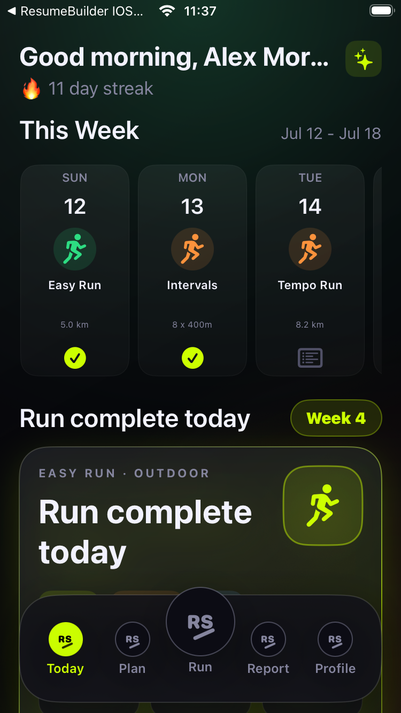
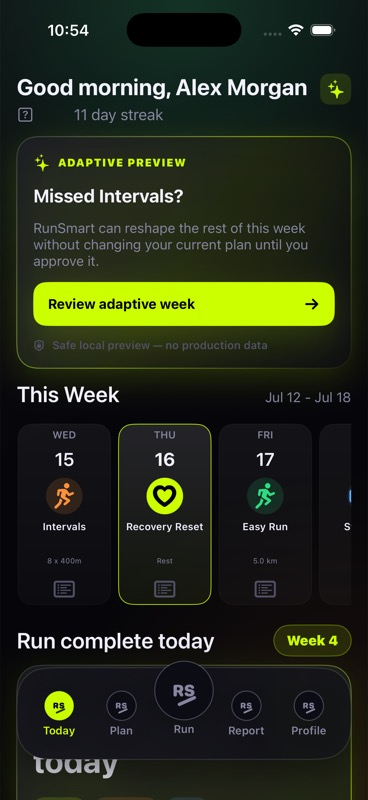
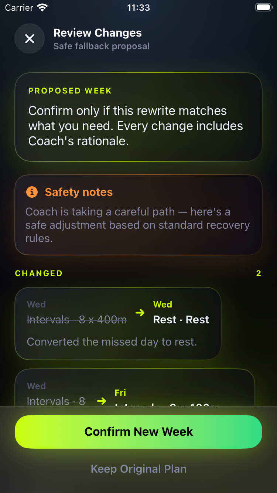

# RunSmart Adaptive Preview — Side-by-Side QA

Date: 2026-07-16
Branch: `codex/runsmart-adaptive-preview`
Release impact: none — local Debug preview only

## Result

The current RunSmart app remains `com.runsmart.lite` and a second app, **RunSmart Adaptive**, installs as `com.runsmart.lite.adaptive`. Both were installed simultaneously on the same iOS Simulator. No App Store, TestFlight, production-backend, Garmin, HealthKit, paywall, migration, or production-data action was performed.

## What the founder can play with

1. Open the `RunSmart Adaptive` scheme in Xcode.
2. Run it on an iPhone Simulator.
3. On Today, tap **Review adaptive week**.
4. The existing Flex Week flow opens with **I missed a workout** selected.
5. Continue to review the proposed changes and Coach rationale.
6. Choose **Keep Original Plan** or **Confirm New Week**. Both operate only on local demo services.

To reset the preview, stop and relaunch the Adaptive app. Its missed-run fixture is deterministic and does not depend on a real account.

## Evidence

### Current RunSmart — unchanged Today surface

### RunSmart Adaptive — explicit local preview

### Proposed week — rationale and reversible controls

## Verification

- Adaptive build: passed for `RunSmart Adaptive` / `Adaptive Debug`.
- Current build: `IOS RunSmart app` Debug test host compiled after all changes.
- Production Release build: passed; metadata remains `RunSmart` / `com.runsmart.lite` / `production`, and the adaptive card's user-facing strings are absent from the optimized binary.
- Built metadata: current `RunSmart` / `com.runsmart.lite` / `production`; adaptive `RunSmart Adaptive` / `com.runsmart.lite.adaptive` / `adaptive`.
- Side-by-side install: both bundle IDs present simultaneously on Simulator.
- Production visibility: current Today screenshot has no Adaptive Preview card; policy test also asserts production-hidden behavior.
- Adaptive walkthrough: Today card → missed-workout reason → proposed-week diff reached successfully.
- Regression found and fixed: moved missed workouts now reuse the destination slot identity, preventing duplicate IDs in the diff.
- Focused test source compiles with `build-for-testing`.

## XCTest caveat

The local Xcode test runner did not complete runtime execution. Across iOS 26.3 and 26.5 Simulators it stalled at `waiting for workers to materialize`; one signed retry also exposed existing resource-metadata signing noise in cached package bundles. This is an environment/tooling caveat, not a claimed green test run. The adaptive app and repaired diff were verified manually end to end.

## Safety gates still in force

- Do not merge without founder review.
- Do not add an Adaptive Release configuration.
- Do not upload this bundle to TestFlight or App Store Connect.
- Do not connect adaptive preview behavior to production accounts or telemetry.
- Any production exposure requires a separate approval and activation-evidence gate.
